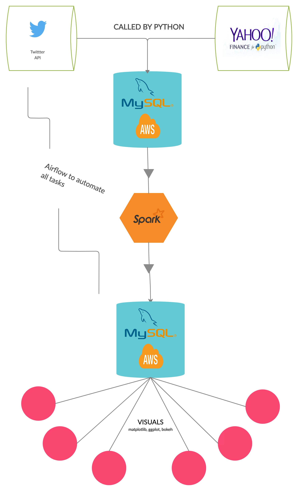

## Sentiment.Analysis

Our chosen topic is Sentiment Analysis regarding its effect on publicly traded stock. We will be monitoring daily summed mentions on identified stocks, from [Twitter](https://developer.twitter.com/en/docs), and Headline totals gathered from [NewsAPI](https://newsapi.org/) to see if any correlation can be acknowledged between this and their stock price. 

Using Airflow and Python, we will use the [Yahoo Finance API](https://pypi.org/project/yfinance/) to keep up to date on price changes (opening and closing daily).

Data obtained from each source will be stored into a MYSQL database.

We will connect Jupyter to SQL to load the data. We will then use bokeh to plot said data and a correlation matrix to evaluate our process.

 

# APIs Used
Twitter API
News API
Yfinance API

# Frameworks/Platforms Used
Airflow
Spark
Pandas
NLTK
Bokeh

## About our group:

# Amit Samra
  A curious and driven personality interested in exploring the intersection of Big Data and Finance. I have an educational background in Economics & Finance with professional experience in financial services.
  [Connect with me](https://www.linkedin.com/in/amitsamra/)

 

# Preeti Sehgal
  Masters in Physics and a Former undergrad Physics teacher. I have a passion for collecting and analyzing data to find meaningful trends. I'm a team player with strong analytical skills.

  [Connect with me](https://www.linkedin.com/in/preetisehgal18/)

 

# Rich Maiale
  My background is in management and sales.  I've long been an advocate of solving problems using empirical solutions, employing spreadsheets, CRMs, and costing formulas to improve my working environment.

  [Connect with me](https://www.linkedin.com/in/rich-maiale/) 

